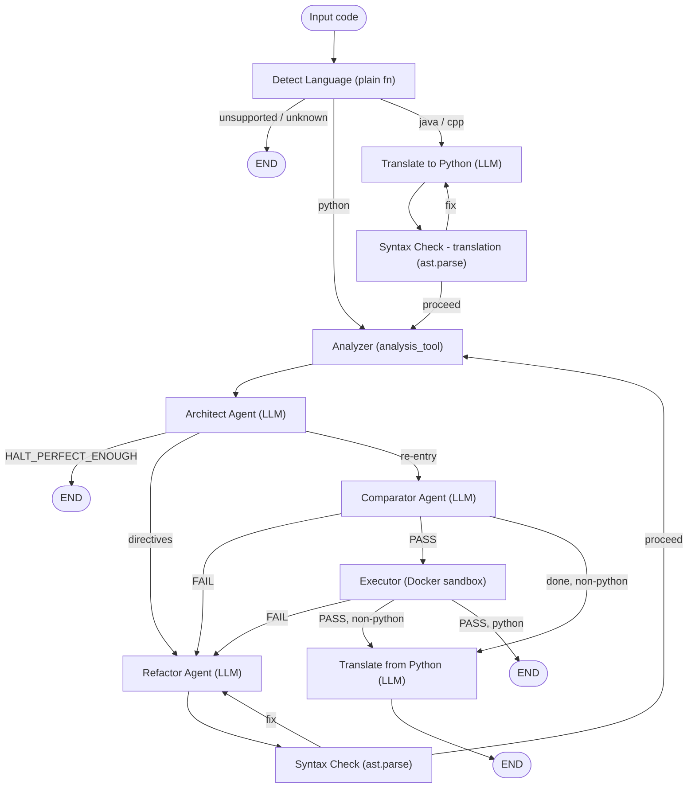

# 🛡️ CodeGuard

> Multi-agent Python code analysis and automated refactoring powered by LangGraph.
> 

## What is CodeGuard?

CodeGuard is an agentic pipeline that takes raw code, detects its language, analyzes it for quality issues, automatically refactors it, and validates the result — all without human intervention. Python is analyzed directly; Java and C++ are translated to Python, processed, then translated back.

## Architecture

CodeGuard is built on **LangGraph**. The pipeline is composed of **four LLM agents** and several deterministic plain-function nodes wired together as a directed graph with conditional edges and a hard cap of `max_iterations` (default 3) refactor loops.



### LLM agents (four)

- **Translator Agent** — converts Java/C++ → Python before analysis, and Python → the original language after refactoring. Runs only for non-Python input.
- **Architect Agent** — runs after every analyzer pass. Consumes the raw analyzer report, validates its own output against a Pydantic schema (with retries), classifies findings (SOLID / Clean Code / Complexity) with severity + confidence, and emits a numbered, severity-sorted list of **refactor directives**. The global verdict (`PROCEED_TO_REFACTOR` vs `HALT_PERFECT_ENOUGH`) is recomputed in code, never trusted from the model.
- **Refactor Agent** — rewrites code to satisfy the Architect's directives on the first pass, and on re-entry fixes only what the Syntax Check, Comparator, or Executor flagged.
- **Comparator Agent** — diffs the baseline Architect report against the latest one and returns PASS / FAIL.

### Plain-function nodes (no LLM)

- **Detect Language** — regex scoring with positive/negative signals to pick Python / Java / C++ or mark input unsupported/unknown.
- **Analyzer** — calls `analysis_tool` directly. The first run is captured as the baseline report.
- **Syntax Check** — `ast.parse()` on refactored (and separately on translated) code; loops back on failure.
- **Executor** — calls `execute_code_tool` to run the code in a Docker container.

### Tools

- `analysis_tool` — single merged tool: time & space complexity, SOLID violations (SRP / OCP / LSP / ISP / DIP), and a clean-code index.
- `execute_code_tool` — runs code in a Docker container, auto-installing third-party imports via pip before execution.

## Models

| Node | Type | Model (default) | Provider | Temp |
| --- | --- | --- | --- | --- |
| Detect Language | Plain fn | — | — | — |
| Translator | LLM | `model3` (e.g. `llama-3.3-70b-versatile`) | Groq | 0.2 |
| Analyzer | Plain fn | — | — | — |
| Architect | LLM | `meta-llama/llama-4-scout-17b-16e-instruct` | Groq | 0 |
| Refactor | LLM | `model1` (e.g. `openrouter/owl-alpha`) | OpenRouter | 0.2 |
| Syntax Check | Plain fn | — | — | — |
| Comparator | LLM | `model2` (e.g. `llama-4-scout-17b-16e-instruct`) | Groq | 0.1 |
| Executor | Plain fn | — | — | — |

## Project Structure

```
CodeGuard/
├── app/
│   ├── agents/
│   │   ├── architect.py        # Architect Agent (LLM)
│   │   ├── comparator.py       # Comparator Agent (LLM)
│   │   ├── refactor.py         # Refactor Agent (LLM)
│   │   └── translator.py       # Translator Agent (LLM)
│   ├── graph/
│   │   ├── __init__.py         # exposes build_graph
│   │   ├── nodes.py            # plain-function nodes + language detection
│   │   ├── routers.py          # conditional-edge routing logic
│   │   └── workflow.py         # StateGraph wiring (build_graph)
│   ├── helpers/
│   │   └── config.py           # pydantic-settings
│   ├── prompts/
│   │   ├── architect_prompt.py
│   │   ├── comparator_prompt.py
│   │   ├── refactor_prompt.py
│   │   └── translator_prompt.py
│   ├── schemas/
│   │   └── state.py            # AgentState TypedDict
│   ├── services/
│   │   ├── SRP_Detection_Final.py
│   │   ├── OCP_Detection_Final.py
│   │   ├── Liskov_Substitution_Principle.py
│   │   ├── ISP_detect.py
│   │   ├── dependancy_principle.py
│   │   ├── clean_code.py
│   │   ├── complexity.py
│   │   ├── executer.py         # Docker sandbox runner
│   │   └── tests/              # calibration scripts (SRP / LSP / DIP)
│   ├── tools/
│   │   ├── analysis_tool.py
│   │   └── execute_code_tool.py
│   ├── app.py                  # Streamlit web UI
│   ├── main.py                 # CLI entry point
│   ├── llms.py                 # LLM instantiation (Groq + OpenRouter)
│   ├── requirements.txt
│   └── .env.example
├── LICENSE
└── README.md
```

## Requirements

- Python 3.11+
- Docker Desktop (must be running)
- A Groq API key (free)
- An OpenRouter API key (free)
- A LangSmith API key (optional, for tracing)

## Installation

```bash
git clone https://github.com/AbdallahSabry7/CodeGuard.git
cd CodeGuard/app

python -m venv venv
# Windows
venv\Scripts\activate
# macOS / Linux
source venv/bin/activate

pip install -r requirements.txt
```

## Environment Setup

Copy the example env file (in `app/`) and fill in your keys:

```bash
cp .env.example .env
```

```bash
GROQ_API_KEY=
OPENROUTER_API_KEY=
LANGSMITH_API_KEY=
LANGCHAIN_TRACING_V2=true
LANGCHAIN_ENDPOINT=https://api.smith.langchain.com
LANGCHAIN_PROJECT=CodeGuard

model1=openrouter/owl-alpha
model2=meta-llama/llama-4-scout-17b-16e-instruct
model3=llama-3.3-70b-versatile
openai_api_base=https://openrouter.ai/api/v1

max_iterations=3
```

| Key | Where to get it |
| --- | --- |
| `GROQ_API_KEY` | console.groq.com → API Keys |
| `OPENROUTER_API_KEY` | openrouter.ai/keys |
| `LANGSMITH_API_KEY` | smith.langchain.com → Settings → API Keys |

## Docker Setup

CodeGuard executes refactored code inside a Docker container. Docker Desktop must be installed and **running** before you start CodeGuard.

```bash
docker pull python:3.11-slim
docker run --rm python:3.11-slim python --version   # should print Python 3.11.x
```

<aside>
⚠️

**Security note — the sandbox is hardened but not network-isolated.** The Executor runs with `cap_drop=["ALL"]`, `no-new-privileges`, a 128 MB memory cap, a 64-process limit, and a 60-second timeout. However, **network access is enabled** and the **filesystem is writable**, because the Executor auto-installs third-party imports with `pip` at runtime. Dangerous calls/imports (`eval`, `exec`, `subprocess`, `socket`, etc.) are hard-blocked by an AST check; sandbox-incompatible but harmless patterns (`os`, `sys`, `open`, ...) are reported as PASS with a note. Do not treat this as a fully isolated sandbox for untrusted code.

</aside>

### Sandbox constraints (actual)

| Constraint | Value |
| --- | --- |
| Base image | `python:3.11-slim` |
| Timeout | 60 seconds |
| Memory limit | 128 MB |
| CPU quota | 50000 |
| PID limit | 64 |
| Network | Enabled (for pip install) |
| Filesystem | Writable |
| Capabilities | `cap_drop=ALL`, `cap_add=[SETUID, SETGID]`, `no-new-privileges` |
| Output cap | 4000 chars (stdout/stderr each) |

## Usage

Run commands from inside the `app/` directory.

### Web UI (Streamlit)

```bash
streamlit run app.py
```

Open the local URL Streamlit prints. Paste Python (or Java/C++) code and run the analysis; results stream across the report, refactored-code, comparator, and execution views.

### CLI

```bash
python main.py --file path/to/your_code.py
cat your_code.py | python main.py --stdin
```

## License

Apache-2.0