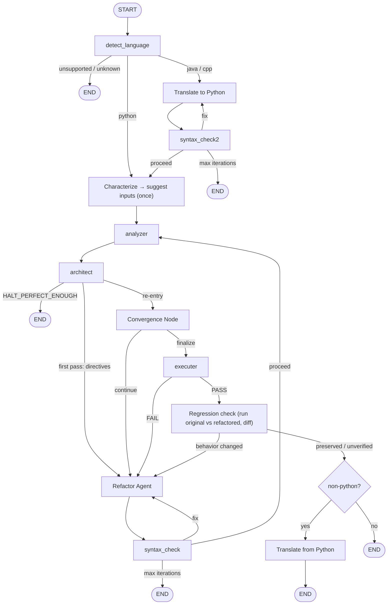

> Multi-agent Python code analysis and automated refactoring, exposed through a full-stack web app (React + FastAPI) and powered by LangGraph.

> Astivora takes raw code, detects its language, runs deterministic SOLID / complexity / clean-code analysis, then drives an agentic LangGraph pipeline that automatically refactors the code, validates it, executes it (for Python) in a hardened Docker sandbox, and runs a lightweight **behavioral regression check** (original vs refactored) before finalizing. Python is analyzed directly; Java and C++ are translated to Python, processed, then translated back.

The project is a **monorepo** with four cooperating parts:

| Part | Path | Stack | Role |
| --- | --- | --- | --- |
| Frontend | `frontend/` | Vite + React 19 + TypeScript | Web UI: editor, live analysis, reports, history, GitHub repo analysis |
| Backend API | `backend/` | FastAPI + Uvicorn | WebSocket + REST API, GitHub OAuth, history persistence |
| AI service | `ai_service/` | LangGraph + LangChain | The multi-agent analysis/refactor pipeline, plus a standalone Streamlit UI and CLI |
| Database / Auth | `database/` | MongoDB (Motor) + JWT | GitHub OAuth, user records, analysis history |

<aside>
🔗 The backend imports the analysis engine and agent graph directly from `ai_service/app` via `sys.path`, so the two services run in one Python process.
</aside>

## Architecture (AI pipeline)

The pipeline combines **three core LLM agents** (Translator, Architect, Refactor), one **LLM-assisted Characterizer**, and several **deterministic plain-function nodes** — including a **Convergence controller** (which replaced the old LLM Comparator) and a **Regression check** — wired together as a directed graph with conditional edges and a hard cap of `max_iterations` (default 3) refactor loops.



### LLM agents + Characterizer

- **Translator Agent** — converts Java/C++ → Python before analysis, and Python → the original language after refactoring. Runs only for non-Python input.
- **Architect Agent** — runs after every analyzer pass. Consumes the raw analyzer report, validates its own output against a Pydantic schema (with retries), classifies findings (SOLID / Clean Code / Complexity) with severity + confidence, and emits a numbered, severity-sorted list of refactor directives. The verdict (`HALT_PERFECT_ENOUGH` vs proceed) is recomputed in code, never trusted from the model.
- **Refactor Agent** — rewrites code to satisfy the Architect's directives on the first pass, and on re-entry fixes only what the Syntax Check, Executor, or **Regression check** flagged (in that priority order).
- **Characterizer (LLM-assisted)** — runs once at ingestion. Reads the Python original, decides the behavioral boundary (`stdio` vs `api`), and designs a coverage-minded input suite. The LLM only **suggests** the inputs; running both versions on them and comparing observations happens later in the Regression check and is fully deterministic.

### Plain-function nodes (no LLM)

- **detect_language** — regex scoring with positive/negative signals to pick Python / Java / C++ or mark input unsupported/unknown.
- **analyzer** — calls `analysis_tool` directly. The first run is captured as the baseline report; afterwards it always routes to the Architect.
- **syntax_check / syntax_check2** — `ast.parse()` on refactored code (and separately on translated code); loops back on failure, up to `max_iterations`.
- **Convergence Node** — turns the latest Architect report into a single weighted score (severity- and complexity-weighted, lower is better, `0` = clean), appends it to a history, and decides **continue** (refactor again) vs **finalize** (hand off to the Executor). Replaces the old LLM Comparator with a reproducible, explainable stop condition.
- **executer** — calls `execute_code_tool` to run the code in a Docker container.
- **Regression check** — runs the **original** and the **refactored** code on the Characterizer's suggested inputs and diffs observable behavior (stdout + exception kind). `changed` → back to Refactor with the failing input as evidence; `preserved` / `unverified` → proceed (only a true `changed` verdict blocks).

### Behavioral regression check

A refactor is *supposed* to rename, split, merge, add, and delete functions — so behavior cannot be checked per-function. Astivora checks it at the **boundary**, by running both versions **live** and diffing them (no stored snapshot, so nothing can go stale):

1. **Suggest inputs once** — the Characterizer (LLM) decides the boundary (`stdio` vs `api`) and proposes a small input suite. It only *suggests* inputs; it never judges correctness.
2. **Differential run** — after the refactored code passes the Executor, feed the same inputs to **both** the original and the refactored code and compare observations (stdout + exception kind) with a plain `==`. Internal renames/splits/additions are invisible by construction.

Verdicts: **preserved** (`SAME`), **changed** (`DIFFERENT`, with a counterexample), or **unverified** (`INCONCLUSIVE` — the original couldn't be run cleanly or no cases could be generated). `unverified` is flagged but **never blocking** and never counted as a pass; only a genuine `changed` verdict sends code back to Refactor.

**Limitations:** it is a smoke test, not a proof — it compares stdout + exception kind on a small, LLM-suggested input set at the Python boundary only; it does not check non-stdout side effects (files, network, DB); for Java/C++, behavior is checked on the Python translation, not the final translated-back artifact. Rigorous equivalence (coverage-guided differential testing, side-effect capture) is future work.

### Tools

- `analysis_tool` — single merged tool: time & space complexity, SOLID violations (SRP / OCP / LSP / ISP / DIP), and a clean-code index.
- `execute_code_tool` — runs code in a Docker container, auto-installing third-party imports via pip before execution.
- `convergence` — deterministic quality scoring: `score_report`, `compare_reports`, and the `ConvergenceController` stop logic.
- `regression_check` — deterministic runner + `differential_check`: runs the original vs the refactored code on the same inputs and diffs observable behavior.

## Models

| Node | Type | Model (default) | Provider | Temp |
| --- | --- | --- | --- | --- |
| Translator | LLM | `model3` (e.g. llama-3.3-70b-versatile) | Groq | 0.2 |
| Characterizer | LLM-assisted | `model2` (e.g. llama-4-scout-17b-16e-instruct) | Groq | 0.1 |
| Architect | LLM | meta-llama/llama-4-scout-17b-16e-instruct | Groq | 0 |
| Refactor | LLM | `model1` (e.g. openrouter/owl-alpha) | OpenRouter | 0.2 |
| detect_language · analyzer · syntax_check · convergence · regression check · executer | Plain fn | — | — | — |

## Project structure

```text
code-analysis/
├── frontend/                 # Vite + React 19 + TypeScript web app (port 3000)
│   ├── App.tsx               # Root component; WebSocket client + GitHub OAuth callback
│   ├── index.tsx / index.html
│   ├── components/           # Dashboard, CodeEditor, Results, OptimizeReport,
│   │                         # SolidReport, CleanCodeReport, Time/SpaceComplexityReport,
│   │                         # RepoPicker, RepoAnalysis, HistorySidebar, LoginPage, ...
│   ├── contexts/ThemeContext.tsx
│   ├── types.ts
│   ├── vite.config.ts        # dev server on port 3000
│   └── package.json
├── backend/
│   ├── app/main.py           # FastAPI app: /ws/analyze, /history, /github/analyze-repo
│   └── requirements.txt      # backend + AI deps (fastapi, motor, langgraph, docker, ...)
├── ai_service/
│   └── app/
│       ├── agents/           # architect, characterizer, refactor, translator (LLM agents)
│       ├── graph/            # nodes.py (+ convergence_node, regression_check_node), routers.py
│       │                     #   (+ convergence_router, regression_router), workflow.py (build_graph), __init__
│       ├── services/         # SRP/OCP/LSP/ISP/DIP detectors, clean_code, complexity, executer
│       │   └── tests/        # calibration scripts (SRP / OCP / LSP / ISP / DIP)
│       ├── tools/            # analysis_tool.py, execute_code_tool.py, convergence.py, regression_check.py
│       ├── prompts/          # architect / characterize / refactor / translator prompts
│       ├── schemas/state.py  # AgentState TypedDict (+ quality_scores, test_inputs, test_mode,
│       │                     #   test_driver, regression_verdict, regression_report)
│       ├── helpers/config.py # pydantic-settings (reads .env)
│       ├── llms.py           # Groq + OpenRouter LLM instantiation
│       ├── app.py            # Standalone Streamlit UI
│       ├── main.py           # Standalone CLI
│       └── requirements.txt
├── database/
│   ├── auth.py               # GitHub OAuth + JWT + GitHub REST helpers (FastAPI router)
│   ├── database.py           # MongoDB (Motor) client; db.users, db.history
│   └── init.sql              # (empty — unused; the app uses MongoDB)
├── data/                     # Datasets + notebooks used to calibrate the detectors
├── documentation/            # Design docs (SOLID principle write-ups)
├── main.py                   # ⚠️ Stale duplicate of backend/app/main.py (see Notes)
├── dockercompose.yml         # (empty stub)
├── .env.example
└── LICENSE                   # Apache-2.0
```

## Requirements

- Python 3.11+
- Node.js 18+ (for the frontend)
- MongoDB (local `mongodb://localhost:27017` or Atlas)
- Docker Desktop (must be running — used by the code Executor and the regression check)
- A Groq API key and an OpenRouter API key
- A GitHub OAuth App (for login + repo analysis)
- A LangSmith API key (optional, for tracing)

## Setup

```bash
git clone https://github.com/mrieden/code-analysis.git
cd code-analysis
```

### 1. Backend + AI service

```bash
python -m venv venv
# Windows
venv\Scripts\activate
# macOS / Linux
source venv/bin/activate
pip install -r backend/requirements.txt
```

Create a `.env` in the repo root (loaded by both the AI settings and the backend):

```bash
# ── LLMs (required) ──
GROQ_API_KEY=
OPENROUTER_API_KEY=
model1=openrouter/owl-alpha                          # Refactor
model2=meta-llama/llama-4-scout-17b-16e-instruct     # Characterizer
model3=llama-3.3-70b-versatile                       # Translator
openai_api_base=https://openrouter.ai/api/v1

# ── Loop controls ──
max_iterations=3
max_improvement_loops=3
min_gain=0.05

# ── LangSmith (optional) ──
LANGSMITH_API_KEY=
LANGCHAIN_TRACING_V2=true
LANGCHAIN_ENDPOINT=https://api.smith.langchain.com
LANGCHAIN_PROJECT=Astivora

# ── Database ──
MONGODB_URL=mongodb://localhost:27017
DB_NAME=owlint

# ── GitHub OAuth + JWT ──
GITHUB_CLIENT_ID=
GITHUB_CLIENT_SECRET=
JWT_SECRET=change-me-in-prod
FRONTEND_URL=http://localhost:3000
```

<aside>
🔑 Create the GitHub OAuth App at GitHub → Settings → Developer settings → OAuth Apps. Set the Authorization callback URL to `http://localhost:8000/auth/github/callback`.
</aside>

Run the API (from the repo root) on port 8000:

```bash
uvicorn backend.app.main:app --reload --port 8000
```

### 2. Frontend

```bash
cd frontend
npm install
npm run dev   # serves on http://localhost:3000
```

The frontend talks to the backend at `ws://localhost:8000/ws/analyze` (live analysis) and the REST endpoints. Open http://localhost:3000 and sign in with GitHub.

### 3. Docker sandbox image (for the Executor)

```bash
docker pull python:3.11-slim
```

## API surface (backend)

| Method | Path | Description |
| --- | --- | --- |
| WS | `/ws/analyze` | Live static analysis on every keystroke; full agent pipeline on "Optimize" |
| GET | `/history` | Logged-in user's analysis history |
| DELETE | `/history/{entry_id}` | Delete a history entry |
| POST | `/github/analyze-repo` | Static analysis across every Python file in a repo |
| GET | `/auth/github/login` | Start GitHub OAuth |
| GET | `/auth/github/callback` | OAuth callback → issues JWT → redirects to frontend |
| GET | `/auth/me` | Current user |
| GET | `/github/repos` · `/github/tree` · `/github/file` | Browse the user's GitHub repos/files |

## Standalone AI service (optional)

The `ai_service` can be run on its own without the web app:

```bash
cd ai_service/app
pip install -r requirements.txt
# Streamlit UI
streamlit run app.py
# CLI
python main.py
```

## Sandbox security note

The Executor runs refactored code in a Docker container with `cap_drop=["ALL"]`, `no-new-privileges`, a memory cap, a process limit, and a timeout. The regression check runs the original and refactored code through the same sandbox. Dangerous calls/imports (`eval`, `exec`, `subprocess`, `socket`, ...) are hard-blocked by an AST check. Network access is enabled and the filesystem is writable so pip can install third-party imports at runtime, so do not treat it as a fully isolated sandbox for untrusted code.

## Notes / known gaps

- **`/main.py` (repo root) is a stale duplicate** of `backend/app/main.py` with broken `sys.path` math and a missing `database/` path; running `python main.py` from the root will fail. Use `uvicorn backend.app.main:app`. Consider deleting the root copy.
- **Docker stubs are empty:** `dockercompose.yml`, `backend/dockerfile`, `ai_service/dockerfile`, and `frontend/dockerfile` are all 0-byte placeholders — there is no working container orchestration yet.
- **`database/init.sql` is empty and unused** (the app persists to MongoDB, not SQL).
- The frontend's backend URLs (`localhost:8000`) and the backend's CORS/redirect origins (`localhost:3000`) are hard-coded; change them in code for non-local deployments.

## License

Apache-2.0
